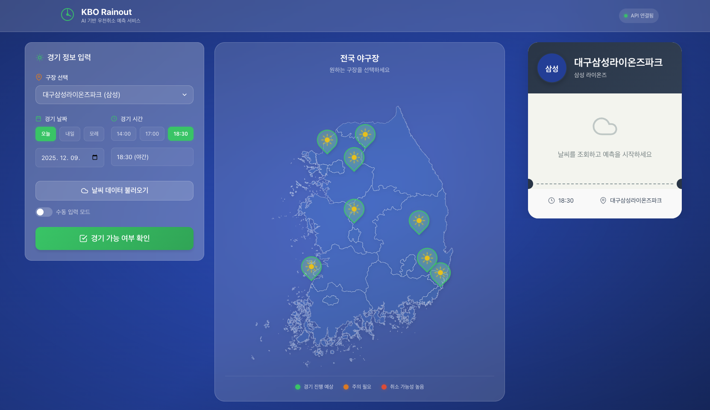
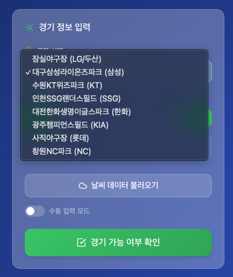
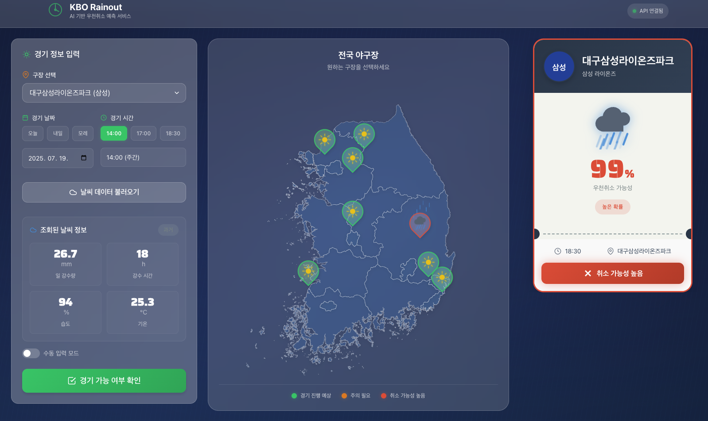

# KBO Rainout Predictor

KBO(한국야구위원회) 경기의 우천취소 가능성을 예측하는 머신러닝 기반 웹 애플리케이션입니다.

## 프로젝트 개요

이 프로젝트는 과거 KBO 경기 데이터와 기상 데이터를 분석하여 특정 날씨 조건에서 경기가 취소될 확률을 예측합니다. KBO 전체 8개 야외 구장에 대해 개별 최적화된 XGBoost 모델을 제공합니다.

## 지원 구장

| 구장 | 홈팀 | 모델 |
|------|------|------|
| 잠실야구장 | LG/두산 | 지원 |
| 대구삼성라이온즈파크 | 삼성 | 지원 |
| 수원KT위즈파크 | KT | 지원 |
| 인천SSG랜더스필드 | SSG | 지원 |
| 대전한화생명이글스파크 | 한화 | 지원 |
| 광주챔피언스필드 | KIA | 지원 |
| 사직야구장 | 롯데 | 지원 |
| 창원NC파크 | NC | 지원 |

고척스카이돔(키움)은 돔구장이므로 우천취소 예측 대상에서 제외됩니다.

## 스크린샷

### 메인 화면


### 구장 선택


### 예측 결과


## 기술 스택

### Backend
- **Framework**: FastAPI 0.109+
- **ML Libraries**: XGBoost, scikit-learn
- **Data Processing**: Pandas, NumPy
- **Server**: Uvicorn

### Frontend
- **Framework**: Vue 3.4
- **Language**: TypeScript 5.4
- **State Management**: Pinia
- **Build Tool**: Vite 5.0
- **HTTP Client**: Axios

### Infrastructure
- **Containerization**: Docker, Docker Compose
- **Web Server**: Nginx (프론트엔드)

## 프로젝트 구조

```
kbo_cancel/
├── backend/                    # FastAPI 백엔드
│   ├── api/                    # API 라우트
│   ├── models/                 # ML 모델 로딩 및 예측
│   ├── schemas/                # Pydantic 스키마
│   ├── config.py               # 설정 (구장별 모델 경로)
│   └── main.py                 # 애플리케이션 엔트리포인트
├── frontend/                   # Vue.js 프론트엔드
│   ├── src/
│   │   ├── api/                # API 클라이언트
│   │   ├── components/         # Vue 컴포넌트
│   │   ├── pages/              # 페이지 컴포넌트
│   │   ├── router/             # 라우터 설정
│   │   ├── store/              # Pinia 스토어
│   │   └── styles/             # 스타일시트
│   └── public/                 # 정적 파일
├── models/                     # 학습된 ML 모델 파일 (8개 구장)
│   ├── kbo_jamsil_model.pkl
│   ├── kbo_daegu_model.pkl
│   ├── kbo_suwon_model.pkl
│   ├── kbo_incheon_model.pkl
│   ├── kbo_daejeon_model.pkl
│   ├── kbo_gwangju_model.pkl
│   ├── kbo_busan_model.pkl
│   ├── kbo_changwon_model.pkl
│   └── *.png                   # EDA 및 Feature Importance 시각화
├── data/                       # 구장별 경기 및 날씨 데이터
│   ├── jamsil/
│   ├── daegu/
│   ├── suwon/
│   ├── incheon/
│   ├── daejeon/
│   ├── gwangju/
│   ├── busan/
│   └── changwon/
├── cancel_crawler.py           # KBO 경기 데이터 크롤러
├── weather_collector_openmeteo.py  # 날씨 데이터 수집기
├── kbo_rain_model.py           # 모델 학습 스크립트
├── run_pipeline.py             # 전체 파이프라인 실행
├── stadium_config.py           # 구장 설정 (좌표, 이름 등)
└── docker-compose.yml          # Docker Compose 설정
```

## 설치 및 실행

### 사전 요구사항
- Docker & Docker Compose
- Python 3.11+ (로컬 개발 시)
- Node.js 18+ (로컬 개발 시)

### Docker Compose로 실행하기

```bash
# 전체 애플리케이션 실행
docker-compose up -d

# 프론트엔드: http://localhost:8080
# 백엔드 API 문서: http://localhost:8600/docs
```

### 로컬 개발 환경

#### 백엔드 실행

```bash
cd backend

# 가상환경 생성 및 활성화
python -m venv venv
source venv/bin/activate  # Windows: venv\Scripts\activate

# 의존성 설치
pip install -r requirements.txt

# 서버 실행
uvicorn main:app --reload --host 0.0.0.0 --port 8600
```

#### 프론트엔드 실행

```bash
cd frontend

# 의존성 설치
npm install

# 개발 서버 실행
npm run dev

# 프로덕션 빌드
npm run build
```

## 주요 기능

### 1. 경기 취소 확률 예측
- 날씨 조건(강수량, 습도, 기온, 풍속 등)을 기반으로 취소 확률 계산
- 예측 결과를 높음/중간/낮음으로 분류
- 위험 요소(장마철, 높은 강수량 등) 표시

### 2. 구장별 최적화 모델
- 8개 야외 구장 각각에 대해 학습된 개별 모델
- 구장 선택 시 해당 모델로 예측 수행

### 3. 날씨 데이터 자동 조회
- Open-Meteo API를 통한 날씨 데이터 조회
- 경기 날짜/시간 입력 시 자동으로 날씨 정보 수집

### 4. 데이터 파이프라인
- KBO 공식 사이트에서 경기 데이터 크롤링
- Open-Meteo API를 통한 과거 기상 데이터 수집
- 구장별 데이터 자동 병합 및 전처리

## API 엔드포인트

### Health Check
```
GET /api/health
```

### 구장 목록 조회
```
GET /api/stadiums
```

### 예측
```
POST /api/predict
Content-Type: application/json

{
  "stadium": "jamsil",
  "daily_precip_sum": 50.0,
  "daily_precip_hours": 10.0,
  "pre_game_precip": 15.0,
  "pre_game_humidity": 95.0,
  "pre_game_temp": 25.0,
  "pre_game_wind": 10.0,
  "prev_day_precip": 30.0,
  "daily_wind_max": 20.0,
  "daily_temp_mean": 24.0,
  "month": 7,
  "dayofweek": 5
}
```

### 날씨 데이터 조회
```
POST /api/weather
Content-Type: application/json

{
  "stadium": "jamsil",
  "game_date": "2025-07-15",
  "game_hour": 18
}
```

### 모델 정보
```
GET /api/model-info?stadium=jamsil
```

## 데이터 수집 및 모델 학습

### 특정 구장 파이프라인 실행
```bash
python run_pipeline.py --stadium jamsil
python run_pipeline.py --stadium busan --years 2023 2024
```

### 모든 구장 파이프라인 실행
```bash
python run_pipeline.py --all
```

### 개별 단계 실행
```bash
# 1. 경기 데이터 크롤링
python cancel_crawler.py --stadium jamsil

# 2. 날씨 데이터 수집
python weather_collector_openmeteo.py --stadium jamsil

# 3. 모델 학습
python kbo_rain_model.py --stadium jamsil
```

### 구장 목록 확인
```bash
python cancel_crawler.py --list
```

## 모델 성능

XGBoost 기반 분류 모델 (잠실 기준)

| 지표 | 값 |
|------|------|
| Accuracy | 96.8% |
| F1 Score | 0.82 |
| ROC-AUC | 0.93 |
| 5-Fold CV F1 | 0.78 |

주요 피처 중요도:
1. pre_game_precip (경기 전 3시간 강수량): 50.5%
2. daily_precip_sum (일 총 강수량): 16.8%
3. daily_wind_max (최대 풍속): 7.6%

## 환경 변수

### Backend
Docker 환경에서는 `docker-compose.yml`에서 설정됩니다.
```
MODEL_DIR=/app/models_data
```

### Frontend
`frontend/.env.development` 및 `frontend/.env.production`에서 API 엔드포인트를 설정합니다.

## 라이선스

이 프로젝트는 개인 프로젝트입니다.

## 기여

버그 리포트 및 기능 제안은 Issues를 통해 제출해주세요.
